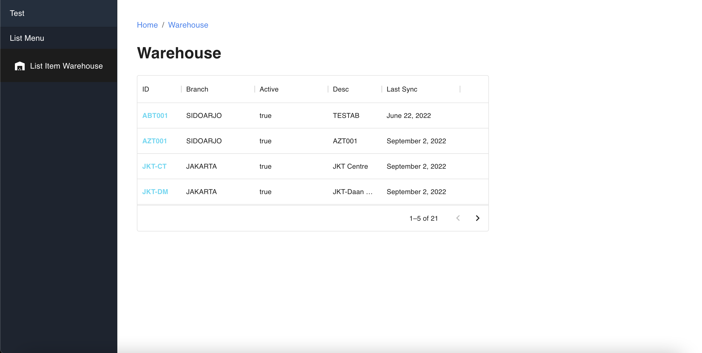
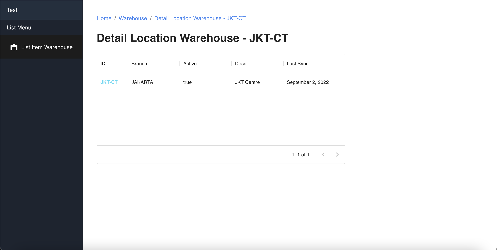

## How To Start In Local Mode

```bash
1. cd/open to project 
2. npm install
3. npm start
```

## Screenshots
<div align="center">
        
    
</div>

## Live Demo
<a href="https://warehouse-test.vercel.app/">
  
</a>
